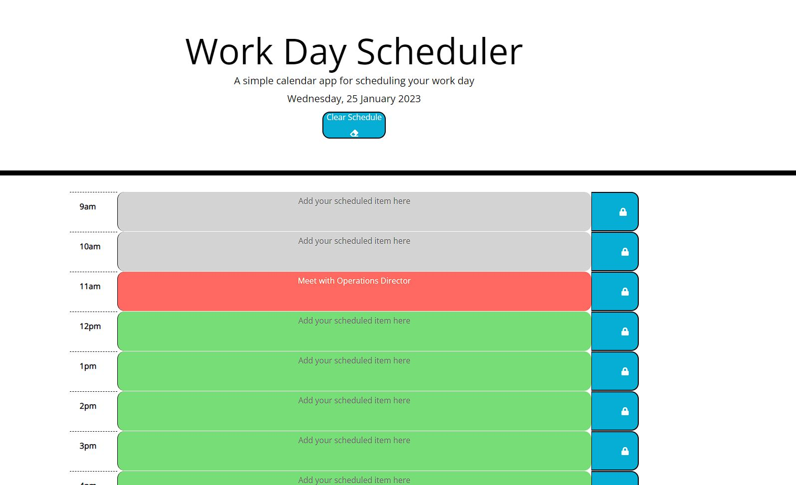

# Daily-Planner-App
A simple single-page work-day calendar application that allows a user to save events for each hour of the day, with dynamically updated colour coding for past, present and future hour(s).

## Description
This project creates a simple calendar application that allows a user to save events for each hour of the day. This app will run in the browser and features dynamically updated HTML and CSS powered by jQuery.

Moment.js libray [Moment.js](https://momentjs.com/) is utilised to work with date and time.

The following shows the web application's appearance and functionality:
 

 

The application:

* Uses a date utility library (Moment.js) to display the current day at the top of the calender when a user opens the planner.
 
* Present timeblocks for standard business hours when the user scrolls down.
 
* Each timeblock is color-coded based on past, present, and future when the timeblock is viewed.
 
* Allows a user to enter an event when they click a timeblock text entry field.

* Saves the users event in local storage when the save button is clicked for that timeblock.

* Events persist between refreshes of the page, unless cleared using the Clear Schedule button at the top of the page.

## Table of Contents

- [Installation](#installation)
- [Usage](#usage)
- [Credits](#credits)
- [License](#license)

## Installation

N/A

## Usage
No special usage instructions, intuitive font-awesome library icons allow for use by saving daily tasks to a desired timeblock with a save button. Likewise, to clear the scheduler for the next day, an intuitive button is presented at the top of the application.

 
https://peafunk3000.github.io/Daily-Planner-App/
 

The repository for this project can be found on my GitHub:
 
https://github.com/PeaFunk3000/Daily-Planner-App/
 

## Credits

N/A

## License

MIT License

